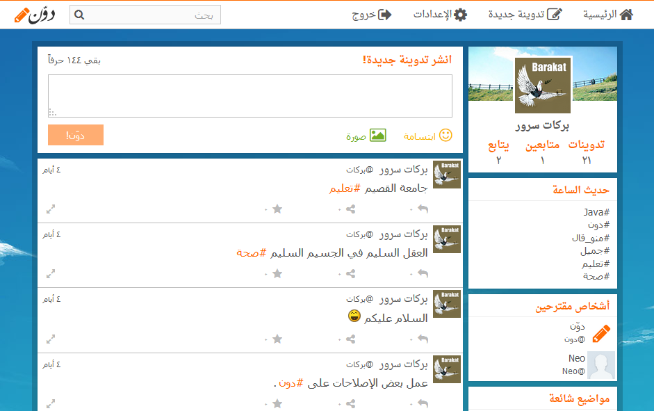

# microblog
A micro-blogging platform in PHP.

# TODO
* Optimize the SQL queries.
* Fix some CSRF bugs.
* ...
* Rewrite the whole project :).

# Project status
This project was a school project for web technophiles course. It's a throw away prototype (Cannot be used in production).

No further development or maintenance is planed.

# Screenshot

